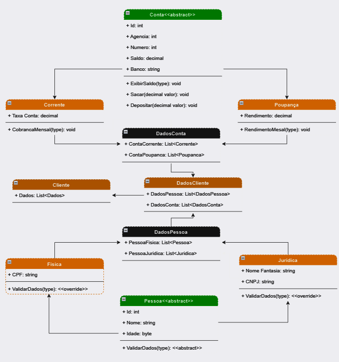
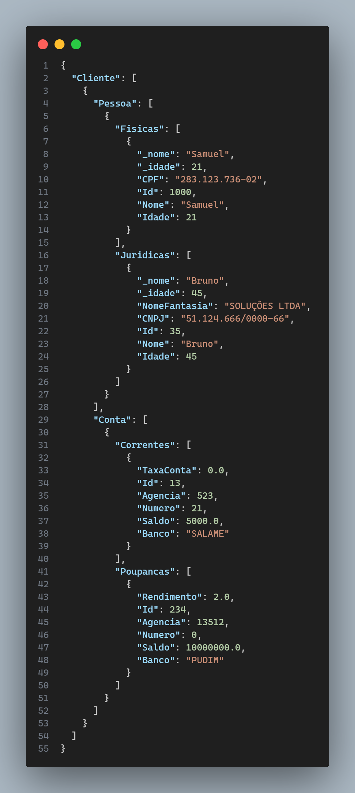

# Abstraindo uma operação bancaria Csharp/.NET

Este projeto é uma abstração de uma operação bancaria, implementado em C#.

Serialização com Newtonsoft.Json
O projeto utiliza a biblioteca Newtonsoft.Json para serializar os dados da venda do notebook. A serialização é um processo de transformar os dados do objeto em um formato que pode ser armazenado ou transmitido e, em seguida, reconstruído posteriormente.

Aqui está um exemplo de como a serialização é realizada neste projeto:

