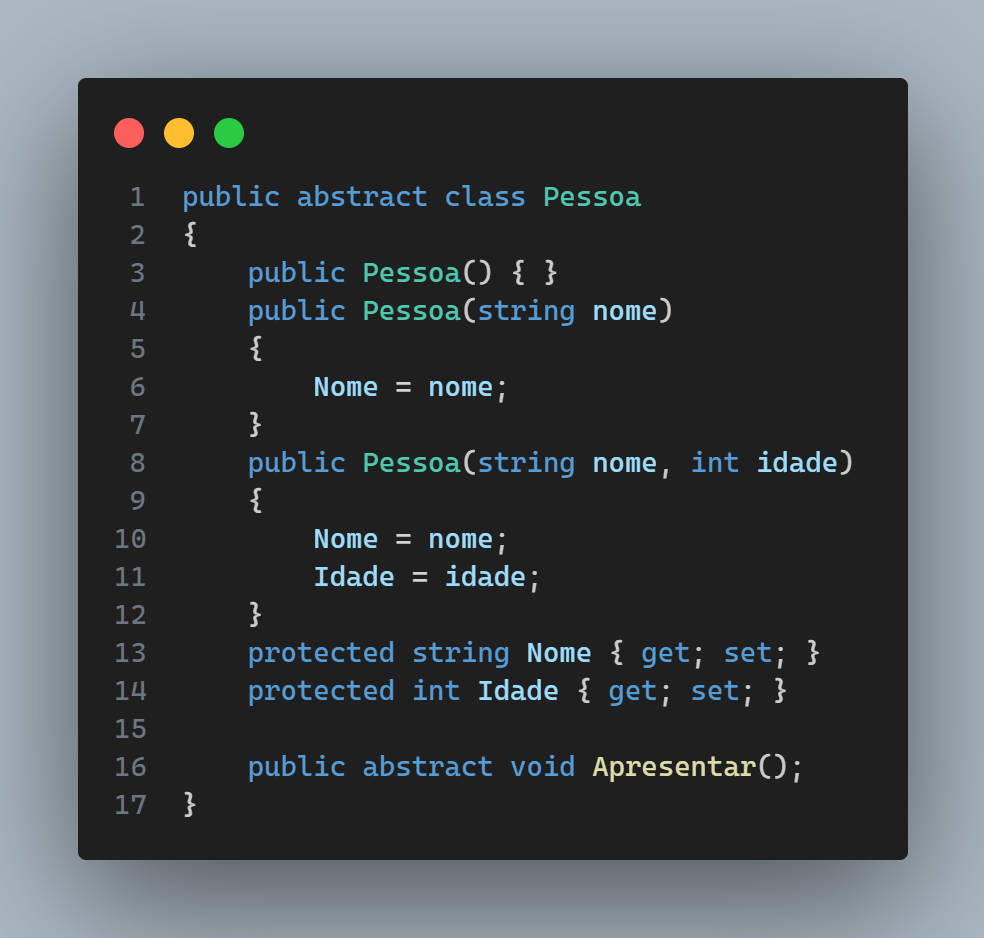
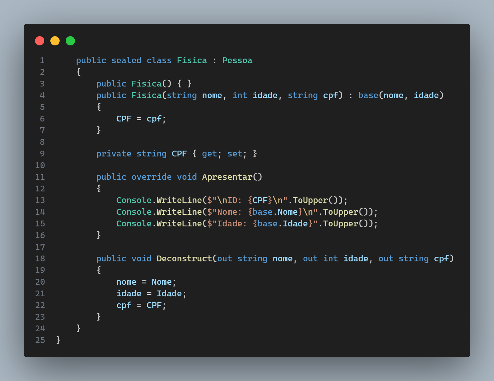
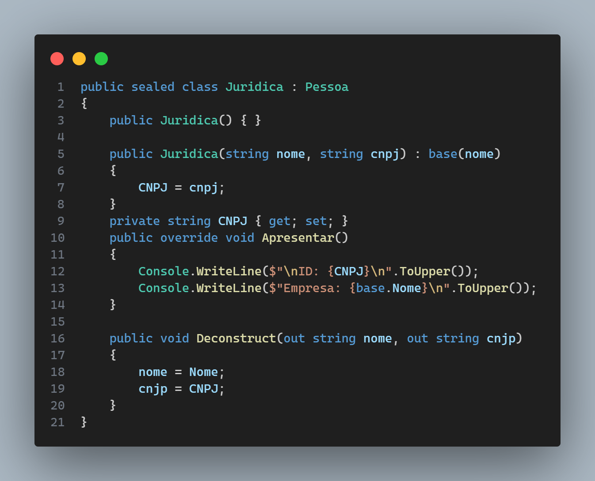
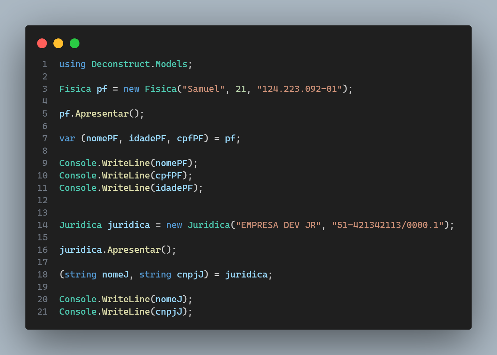

# Deconstruct Objeto .NET

A deconstrução de um objeto é um processo que pode ser considerado o oposto da construção de um objeto.

Enquanto um construtor é usado para inicializar um objeto, a deconstrução é usada para extrair informações importantes de um objeto e transformá-las em variáveis independentes fora da classe.

No entanto, se quisermos extrair essas informações do objeto e usá-las como variáveis independentes, podemos usar a deconstrução.

> Classe abstract - Herança OBRIGATORIO.. Classe abstract não pode ser instanciada. 

> Realizando herança e polimorfismo na classe Pessoa Juridica e Fisica.

> Classe main

